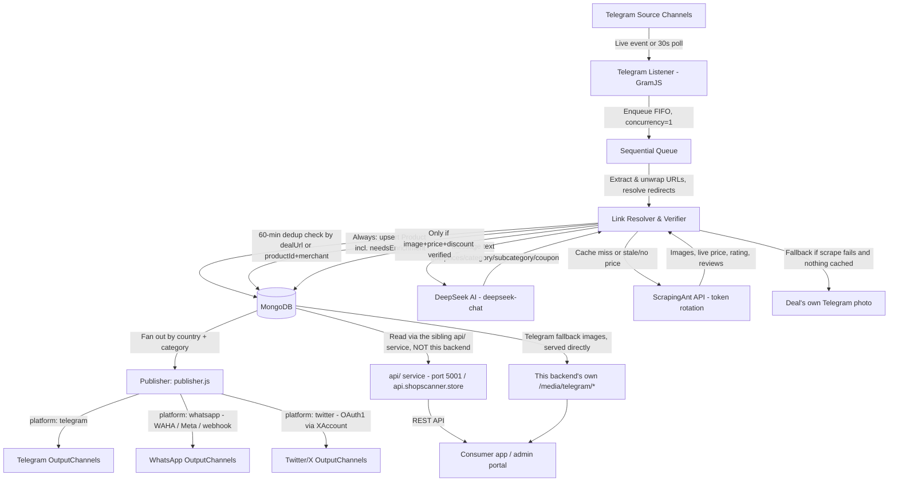

# Project Overview: Shoppers Deals — Backend

> **Scope note:** this file documents the `backend/` service only (this repo folder). The wider
> project is a small monorepo with sibling folders — `admin/` (the static admin portal this
> service serves), `api/` (a separate deployable that appears to hold a duplicate/parallel copy of
> some of these Mongoose models, e.g. `XAccount` — see the comment in
> [`src/db/models/xAccount.js`](../src/db/models/xAccount.js)), and `frontend/` (the consumer app).
> This document does not describe those; treat them as separate codebases that share the same
> MongoDB database.

Shoppers Deals is an automated, real-time deals aggregation and distribution platform. This
backend listens to Telegram deal channels, verifies and enriches what it finds, and republishes
it to Telegram/WhatsApp/Twitter channels and a REST API for the consumer app.

---

## 1. The Core Idea

The backend bridges source Telegram channels (where deals are posted manually or by bots) and
output channels/apps.

### Key features (as actually implemented):

* **Real-time + polled listening** (GramJS): live `NewMessage` events plus a 30-second polling
  fallback per channel, because GramJS event push is unreliable for large broadcast channels.
  Both paths share one "already claimed" map so a message is never double-processed.
* **Dynamic channel list**: the set of monitored channels is re-read from MongoDB every 5 seconds,
  so enabling/disabling a channel from the admin portal takes effect without restarting the
  listener.
* **Link extraction & redirect resolution**: pulls URLs out of message text *and* hidden Telegram
  hyperlink entities, unwraps tracker-wrapped URLs (`go.bigtricks.in/?o=https%3A%2F%2Famazon.in...`),
  and resolves short links (`amzn.to`, `bit.ly`, `fkrt.it`) recursively (up to 5 hops) using
  browser-like headers so anti-bot redirect gates don't block a plain Node `fetch`.
* **Merchant + product-page filtering**: only Amazon/Flipkart/Myntra/Nykaa/Ajio/Shopsy URLs that
  resolve to an actual product page (ASIN `/dp/`, Flipkart `pid`, Myntra `/<id>/buy`, Nykaa
  `/p/<id>`, Ajio `/p/<id>[_variant]`, Shopsy `pid` query param or `/p/itm<id>`) are accepted —
  search/category/storefront links on the same domains are explicitly rejected, not just
  non-supported-merchant domains. Myntra, Nykaa, and Ajio are India-only businesses despite their
  `.com` TLD (neither operates a `.in` domain); Shopsy is `.in` outright and is a Flipkart-owned
  platform built on Flipkart's own commerce stack (shares its `pid` ID shape, serves images off
  Flipkart's `rukmini*.flixcart.com` CDN) but is tracked as its own `merchant` value, not merged
  into `'flipkart'`. All have `derivedCountry` hardcoded to `'IN'`.
* **60-minute deduplication**: checks both the resolved `dealUrl` *and* the merchant
  `(productId, merchant)` pair, since the same product can resolve to different landing-page
  slugs across posts.
* **AI parsing runs before scraping**: DeepSeek (`deepseek-chat`, OpenAI-compatible SDK) parses
  the raw Telegram text first — title, description, prices, discount, category, subcategory, and
  an explicit coupon object. Scraping only happens afterward, and only if needed.
* **Conditional scraping (ScrapingAnt)**: only scrapes the landing page if the cached
  `Product`/`VerifiedLink` record lacks images, or lacks both a price and a fresh-enough cache
  (1-hour cache window). Token rotation across multiple ScrapingAnt trial keys, with automatic
  cooldown (`exhausted`) on HTTP 403/429 and a daily cron that resets any token 30+ days exhausted.
* **Price-history fallback**: if no MRP was found anywhere (message text or scrape), the verifier
  compares the new price against this exact product's own last-recorded price in MongoDB. A ≥5%
  drop counts as a genuine discount; below that it's a best-effort discount% but not treated as a
  confirmed price drop.
* **Telegram-photo fallback image**: if scraping fails and nothing is cached yet, the deal's own
  Telegram post photo is downloaded and served from this backend (`/media/telegram/...`) as a
  last-resort image — but it is only attached to the *Deal*, never written back to the canonical
  *Product* record, so future scraping attempts for that product keep retrying for a real photo.
* **Verification gate**: a Deal is only created/updated when it has an image, a price, *and* a
  genuine discount basis. Anything short of that is still persisted as a `Product` with
  `needsEnrichment: true` so nothing scraped is silently discarded — it just doesn't publish yet.
* **Multi-channel, multi-platform publishing**: verified deals fan out to every active
  `OutputChannel` whose `country`/`category` match the deal (Telegram, WhatsApp — via WAHA, Meta
  Cloud API, or a generic webhook — and Twitter/X), each with its own optional
  `rateLimitMinutes` cooldown. Falls back to the single `.env`-configured Telegram channel if no
  `OutputChannel` documents exist yet.
* **Channel discovery functions** (`syncChannelsFromTelegram()`, `addChannelToMonitor()`,
  `refreshMonitoredChannels()` in `src/listener/telegram.js`): sync all joined Telegram dialogs
  into `monitored_channels` (disabled by default), manually add a channel by handle/ID, and
  toggle channels on/off. **Not exposed over REST from this backend** — this backend's own
  `/api/channels`, `/api/admin` (log buffer + status), `/api/deals`, and `/api/products` routes,
  and the log buffer they read from, were all removed as unused (see
  [tech_details.md §4](./tech_details.md#4-http-server-srcapiserverjs)); the sibling `api/`
  service exposes the equivalent admin/discovery REST surface today.

---

## 2. Step-by-Step Message Processing Pipeline

When a deal message is posted in a monitored Telegram channel, the system processes it through
these steps (see [`src/listener/verifier.js`](../src/listener/verifier.js) for the authoritative
implementation):

1. **Real-Time / Polled Event Capture** (`telegram.js`): GramJS delivers the message (or the 30s
   poller catches it) and checks the channel against the in-memory `resolvedChannelIds` set kept
   in sync with MongoDB (`isActive: true`).
2. **Sequential Queueing (FIFO)**: pushed onto a `p-queue` with `concurrency: 1` so dedup checks
   never race each other.
3. **URL Extraction**: regex over the message text plus any URLs hidden in
   `MessageEntityTextUrl` hyperlink entities.
4. **Redirect Resolution, Unwrapping & Merchant/Product Filtering**: unwrap tracker-embedded
   URLs, follow redirects (max 5 hops, browser headers), clean to a canonical Amazon ASIN,
   Flipkart PID, Myntra product ID, Nykaa product ID, Ajio product ID, or Shopsy `pid` URL. Every
   URL found in the message is tried in order until one resolves to an actual product page on one
   of the six supported merchants; if none do, the message is skipped.
5. **60-Minute Deduplication**: skip if a `Deal` with the same `dealUrl` OR the same
   `(productId, merchant)` was created in the last 60 minutes.
6. **AI Extraction (DeepSeek)**: parses the message text (plus whatever's cached for this
   product) into title/description/prices/discount/category/subcategory/coupon — this happens
   *before* any scraping is attempted.
7. **Cache Check & Conditional Scraping (ScrapingAnt)**: reuse cached product images/price if
   they're present and fresh/complete; otherwise scrape the landing page (with token rotation on
   403/429), parse with Cheerio, and update the `VerifiedLink`/`Product` cache.
8. **Price-History Fallback**: if still no MRP-based discount, compare against the product's own
   last recorded price for a best-effort (or, at ≥5%, "genuine") discount.
9. **Verification Gate & Product/Deal Upsert**: always upsert the `Product` record (even if
   incomplete, flagged `needsEnrichment`); only create/update a `Deal` document if image + price +
   discount basis are all present.
10. **Output Publishing**: fan out to every active `OutputChannel` matching the deal's country and
    category (Telegram/WhatsApp/Twitter), respecting per-channel rate limits; falls back to the
    single `.env` Telegram channel if no `OutputChannel`s are configured.

---

## 3. Platform Architecture Diagram

---

## 4. Where things actually live

* `src/listener/telegram.js` — GramJS client, live + polling listeners, channel discovery/sync.
* `src/listener/verifier.js` — the entire verification/enrichment pipeline (URL handling, dedup,
  DeepSeek call, ScrapingAnt call, price-history fallback, Product/Deal upserts).
* `src/listener/publisher.js` + `src/listener/publishers/*.js` — output fan-out per platform.
* `src/listener/tokenReset.js` — daily ScrapingAnt token-reset cron.
* `src/api/server.js` — a minimal Express app: just `GET /health` and static
  `/media/telegram/*` (Telegram-photo fallback images). Previously carried a full REST API
  (`/api/deals`, `/api/products`, `/api/channels`, `/api/admin`) plus a static admin-portal mount,
  removed after tracing every consumer in the monorepo and confirming none of them called this
  backend's HTTP API — see [tech_details.md §4](./tech_details.md#4-http-server-srcapiserverjs)
  for the history and what's still load-bearing.
* `src/db/models/` — Mongoose schemas (see [tech_details.md](./tech_details.md) for the current
  field-by-field definitions).
* `scripts/` — ~20 standalone one-off/maintenance scripts (backfills, dedup merges, category
  fixes, channel sync/cleanup). Run individually with `node scripts/<name>.js`; none are wired
  into the running service.
</content>
