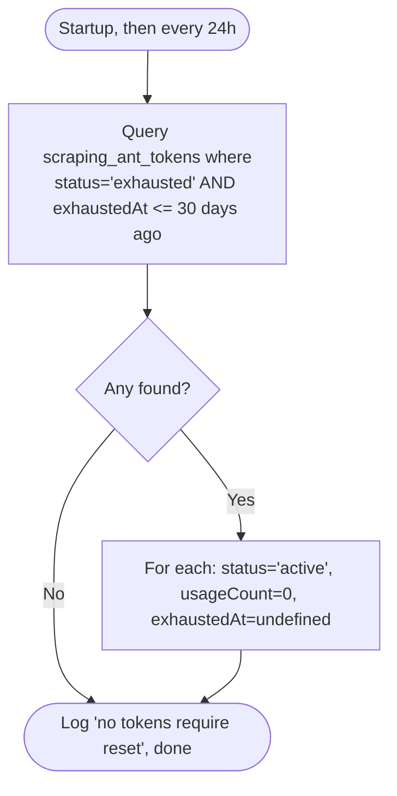

# System Flow Diagram: Shoppers Deals — Backend

This document maps the actual logical flow implemented in `src/listener/telegram.js` and
`src/listener/verifier.js`, cross-checked line-by-line against the code. It supersedes the earlier
version of this file, which described the AI/scraping steps in the wrong order and omitted the
polling fallback, price-history fallback, and per-platform publish fan-out.

---

## 1. Step-by-Step Message Processing Pipeline

```
[Step 1] Message Capture — Live Event OR 30s Poll (telegram.js)
 └── LIVE PATH: GramJS NewMessage event fires. handleNewMessage() builds every possible ID
     representation for the event (bare, "-100"-prefixed, from chatId / peerId.channelId /
     peerId.chatId / peerId.userId) and checks each against the in-memory `resolvedChannelIds` set.
 └── POLL PATH (every 30s, independent of live events): for each active channel, fetches the
     latest 10 messages via client.getMessages(). First poll for a channel just records a
     baseline (no historical backfill); later polls process anything newer than last seen.
 └── RACE GUARD: both paths check/set a shared `lastEnqueuedMessageId` map (keyed by bare channel
     ID) BEFORE enqueueing. Whichever path sees a given message ID first claims it — the other
     silently skips it. This prevents the poller from re-processing what the live handler (or vice
     versa) already grabbed moments earlier.
 └── No match in either path → message silently ignored.

[Step 2] Sequential Queueing (FIFO, concurrency = 1)
 └── Matched messages (from either path) are pushed onto one shared p-queue.
 └── Each task runs to full completion (through Deal save) before the next starts — this is what
     makes the Step 4 dedup check reliable.
 └── `Channel.messagesCapturedCount` / `lastMessageAt` are bumped immediately on capture
     (fire-and-forget); `dealsProducedCount` / `lastDealAt` only bump if a Deal actually results.

[Step 3] URL Extraction, Unwrapping, Redirect Resolution & Product Filtering (verifier.js)
 └── extractUrls(text): regex over the message text, PLUS any URL hidden in a
     MessageEntityTextUrl hyperlink entity (extracted separately in telegram.js and appended to
     the text before this function ever runs — "Buy Now" style hyperlinks aren't in plain text).
 └── unwrapEmbeddedUrl(url): checks query-param values (and a raw-decode pass) for an embedded
     amazon.*/flipkart.com/amzn.to/fkrt.it/myntra.com/nykaa.com/ajio.com/shopsy.in URL, e.g.
     go.bigtricks.in/?o=https%3A%2F%2Famazon.in...
 └── resolveRedirect(url, depth<=5): HEAD (falls back to GET) with real Chrome browser headers —
     Node's default "User-Agent: node" gets blocked or interstitial'd by several redirectors.
 └── cleanAndParseUrl(url): builds the canonical URL + extracts ASIN/PID/Myntra-ID/Nykaa-ID/
     Ajio-ID/Shopsy-pid + derives country from the merchant TLD (NOT the posting channel's
     configured country — a Product record is shared across every channel that mentions it, so
     trusting the channel let one differently-tagged repost silently flip a product's country for
     everyone). Myntra, Nykaa, and Ajio are all hardcoded to 'IN' regardless of their .com TLD —
     none of them operates a .in domain, and .com does NOT mean US/global for any of them; Shopsy
     is 'IN' too (it's .in outright, and Flipkart-owned/India-only besides).
 └── CANDIDATE LOOP: every URL found in the message is tried in this same way, in order, until one
     resolves to an actual PRODUCT page on Amazon (ASIN /dp/), Flipkart (pid or /p/), Myntra
     (numeric id + /buy), Nykaa (/p/<numeric id>), Ajio (/p/<code>[_variant]), or Shopsy (pid
     query param, or /p/itm<id> path fallback) — search, category, and storefront links on the
     same domains are explicitly rejected as not-a-product, and any other merchant domain is
     ignored entirely.
 └── None of the message's URLs qualify → message dropped, nothing written to the DB.

[Step 4] 60-Minute Deduplication Window Check
 └── Deal.countDocuments({ createdAt >= now-60min, $or: [{dealUrl}, {productId, merchant}] }).
     Checking productId+merchant too (not just dealUrl) matters because the same product can
     resolve to a different landing-page slug across different posts.
 └── Duplicate found → message dropped here, no AI call, no scrape — this is the main cost guard.

[Step 5] AI Parsing FIRST (DeepSeek) — before any scraping decision
 └── Master collection queried live for the current category list and subcategory taxonomy (no
     hardcoded enums) and injected into the prompt.
 └── DeepSeek (deepseek-chat) parses the raw message text (told to prefer it over any cached
     "previously recorded" price/rating) into: title, description, originalPrice, dealPrice,
     discountPercentage, category, subcategory, coupon.
 └── coupon is a SEPARATE structured extraction — an extra merchant-page coupon on top of the
     deal price, explicitly excluding bank/card offers and the deal's own headline discount.
 └── AI/API unavailable or errors → fallbackParseDeal(): regex price extraction + fitness-keyword
     category guess. No AI-quality subcategory or coupon extraction in this fallback path.

[Step 6] Product Cache Lookup — Decide Whether To Scrape At All
 └── Look up Product + VerifiedLink by productId/cleanUrl (must already have at least one image).
 └── CACHE VALID (skip scrape) when: images exist AND a price is already known (from AI text or
     cache) — OR images exist and lastChecked is under 1 hour old even with no price yet.
 └── Otherwise → Step 7.

[Step 7] Conditional Web Scraping (ScrapingAnt, Token Rotation)
 └── Pick the oldest-lastUsedAt ACTIVE token from scraping_ant_tokens (load-balances usage).
 └── GET api.scrapingant.com/v2/general?x-api-key=<token>&url=<encoded>&browser=true
 └── 403/429 → mark token exhausted (exhaustedAt=now), recursively retry with the next active
     token. No active token left → returns empty result, pipeline continues without scraped data.
 └── 200 → Cheerio parse with merchant-specific selectors (Amazon vs Flipkart vs Myntra vs Nykaa
     vs Ajio vs Shopsy vs generic og:title/og:image fallback) → title, images, rating, reviews,
     price, originalPrice. Myntra/Nykaa/Shopsy selectors are best-effort/unverified against live
     markup (Nykaa and Shopsy are both hashed-classname SPAs, so mainly og:title/og:image are
     relied on); Ajio's selectors (`.prod-name`/`.prod-sp`/`.prod-cp`/`.rating-popup`) WERE
     verified against live markup when added. See tech_details.md §3.6.
 └── Images found → VerifiedLink cache created/updated; if the scrape supplied a price the AI/text
     step didn't have, parsedDeal is patched and discountPercentage recomputed.
 └── No images found:
      ├── Existing Product already has images → reuse those, don't fail the deal.
      ├── Otherwise → lazily download the Telegram POST'S OWN photo (downloadMessagePhoto) as a
      │   last-resort DEAL-only image (never written to the canonical Product, so future scrapes
      │   keep retrying for the real product photo).
      └── No Telegram photo either → abort this message entirely (return null).

[Step 8] Price-History Fallback (only if still no MRP-based discount)
 └── If discountPercentage is still not > 0: look up this exact product's own last-recorded price
     in the `products` collection and diff it against the newly parsed dealPrice.
 └── >= 5% drop → treated as a genuine drop: previousPrice is set to the old cached price,
     priceSource = 'price_history'.
 └── < 5% → still used as a best-effort discount% (may be 0), NOT flagged as a genuine drop, but
     this alone is enough for `hasDiscount` to pass the gate in Step 9 (see there).

[Step 9] Verification Gate & Product/Deal Persistence
 └── Product record is upserted UNCONDITIONALLY — even an incomplete result is saved with
     needsEnrichment: true so nothing scraped is silently lost. needsEnrichment only ever flips to
     false, never back to true, once a later pass clears the bar.
 └── GATE for creating/updating a DEAL: hasImage (dealImages.length>0) AND hasPrice
     (dealPrice != null) AND hasDiscount (a real MRP-based % > 0, OR priceSource === 'price_history'
     even at 0%). Fails → return null, no Deal touched, Step 10/11 never run for this message.
 └── Passes → Deal upserted by matching {dealUrl} OR {productId, merchant}:
      existing deal found → fields refreshed AND createdAt bumped to now (reposts float back to
        top of a chronological feed); coupon is ALWAYS overwritten (including with null — a repost
        without a mentioned coupon means it's no longer being offered).
      no existing deal → new Deal document created, isVerified: true.

[Step 10] Output Channel Fan-Out (publisher.js, called from telegram.js after a Deal is returned)
 └── Query OutputChannel.find({ isActive:true, country: {$in:[deal.country,'all']},
     category: {$in:[deal.category,'all']} }).
 └── ZERO OutputChannels configured in DB → fall back to the single .env-configured Telegram
     channel (fitnessChannel or generalChannel based on deal.category).
 └── For EACH matching channel:
      ├── rateLimitMinutes cooldown not yet elapsed since stats.lastPublishedAt → SKIP this
      │   channel for this deal (dropped, not queued for later).
      └── Otherwise dispatch by platform:
           'telegram'  → HTML message via the listener's own GramJS client.sendMessage().
           'whatsapp'  → provider from credentials.provider ('waha'|'meta'|'webhook', with a
                          legacy field-presence inference for older rows): WAHA simulates a
                          "typing" presence first, then sendImage/sendText; Meta Cloud API posts
                          text-only; webhook POSTs {message, deal} to an arbitrary URL.
           'twitter'   → OAuth1 credentials resolved from a centralized XAccount
                          (credentials.xAccountId) or inline credentials (legacy); image uploaded
                          via the v1.1 media/upload endpoint (v2 rejects OAuth1); text trimmed to
                          280 chars, coupon line dropped first if still over.
 └── Any success → OutputChannel.stats.dealsPublished++, stats.lastPublishedAt = now,
     Deal.publishedStatus.telegram = true, channel _id added to publishedStatus.outputChannels.
```

---

## 2. Mermaid Workflow Diagram

```mermaid
flowchart TD
    ChanLive["Live NewMessage event"] -->|GramJS push| Match{"ID matches an\nactive monitored channel?"}
    ChanPoll["30s poll: getMessages(limit=10)"] -->|independent path| Match

    Match -- "No" --> IgnoreMsg["Ignore silently"]
    Match -- "Yes" --> ClaimCheck{"Already claimed by\nthe other path?\n(lastEnqueuedMessageId)"}
    ClaimCheck -- "Yes" --> IgnoreMsg
    ClaimCheck -- "No" --> Queue["FIFO Queue (concurrency=1)"]

    Queue --> ExtractLinks["Extract URLs: regex text + hidden hyperlink entities"]
    ExtractLinks --> UnwrapResolve["Unwrap embedded URLs, resolve redirects (max 5 hops, browser headers)"]
    UnwrapResolve --> CleanFilter{"First URL that resolves to an Amazon/Flipkart/\nMyntra/Nykaa/Ajio/Shopsy PRODUCT page?"}
    CleanFilter -- "None found" --> DropMsg["Drop message"]

    CleanFilter -- "Found" --> DupCheck{"Deal with same dealUrl OR\n(productId+merchant) in last 60 min?"}
    DupCheck -- "Yes" --> DropMsg
    DupCheck -- "No" --> AICall["DeepSeek: parse title/prices/discount/category/subcategory/coupon"]

    AICall --> CacheCheck{"Product/VerifiedLink cache:\nimages + (price OR <1hr fresh)?"}
    CacheCheck -- "Valid: skip scrape" --> PriceFallback
    CacheCheck -- "Invalid/missing" --> TokenPick["Pick oldest-used ACTIVE ScrapingAntToken"]

    TokenPick --> ScrapeCall["GET ScrapingAnt v2/general"]
    ScrapeCall --> StatusCheck{"HTTP status?"}
    StatusCheck -- "403/429" --> MarkExhausted["Mark token exhausted, retry next token"]
    MarkExhausted --> TokenPick
    StatusCheck -- "200" --> CheerioParse["Cheerio parse: images, price, rating, reviews"]

    CheerioParse --> ImgCheck{"Images found?"}
    ImgCheck -- "Yes" --> SaveCache["Upsert VerifiedLink cache, patch parsedDeal price/discount"]
    ImgCheck -- "No" --> ProdImgFallback{"Existing Product\nalready has images?"}
    ProdImgFallback -- "Yes" --> SaveCache
    ProdImgFallback -- "No" --> TgPhoto{"Telegram post's own\nphoto available?"}
    TgPhoto -- "Yes" --> DealOnlyImage["Use as DEAL-only fallback image\n(never written to Product)"]
    TgPhoto -- "No" --> DropMsg

    SaveCache --> PriceFallback["discountPercentage > 0?"]
    DealOnlyImage --> PriceFallback
    PriceFallback -- "Yes" --> Gate
    PriceFallback -- "No" --> HistoryLookup["Compare vs this product's last known price"]
    HistoryLookup --> Gate{"Gate: image AND price AND\n(real discount OR price_history fallback)"}

    Gate -- "Product upsert ALWAYS happens\n(needsEnrichment=true if gate fails)" --> ProductDB[(products)]
    Gate -- "Fails" --> StopHere["No Deal created/updated"]
    Gate -- "Passes" --> DealUpsert["Upsert Deal by dealUrl OR (productId,merchant)\nbump createdAt, overwrite coupon"]
    DealUpsert --> DealDB[(deals)]

    DealDB --> FanOut["Find active OutputChannels matching\ndeal.country + deal.category"]
    FanOut -- "None configured" --> EnvFallback["Fallback: .env fitnessChannel/generalChannel"]
    FanOut -- "Found" --> RateCheck{"rateLimitMinutes cooldown\nelapsed per channel?"}
    RateCheck -- "No" --> SkipChannel["Skip this channel for this deal"]
    RateCheck -- "Yes" --> PlatformRoute{"platform?"}
    PlatformRoute -- "telegram" --> PubTG["GramJS sendMessage (HTML)"]
    PlatformRoute -- "whatsapp" --> PubWA["WAHA / Meta Cloud API / webhook"]
    PlatformRoute -- "twitter" --> PubTW["OAuth1 via XAccount, v1.1 media upload"]
    EnvFallback --> PubTG

    PubTG --> UpdateStats["OutputChannel.stats++, Deal.publishedStatus.telegram=true"]
    PubWA --> UpdateStats
    PubTW --> UpdateStats
```



---

## 3. Background Reset Cycle (Daily Cron)

Runs once at process startup, then every 24h (`setInterval`, not a real cron library):



---

## 4. Notable divergences from a naive reading of the pipeline

* **AI runs before scraping, not after** — the previous version of this doc had that order
  reversed. Scraping is now a conditional fallback for missing images/price, not a mandatory step.
* **Dedup key is `dealUrl` OR `(productId, merchant)`**, not `dealUrl` alone.
* **A `Product` is written even when a `Deal` is not** — `needsEnrichment: true` is the visibility
  mechanism for "we know about this product but couldn't verify it yet", used by
  `scripts/backfill_products.js` and similar maintenance scripts.
* **There's a price-history fallback path** with its own 5% "genuine drop" threshold that doesn't
  appear in the original docs at all.
* **The listener has two independent capture paths** (live push + 30s poll) reconciled through a
  shared claim map — not a single GramJS event stream.
* **Publishing is multi-platform and multi-channel**, not a single hardcoded Telegram channel per
  category — `OutputChannel` documents (with country/category matching and per-channel rate
  limits) are the primary mechanism; the `.env` Telegram channels are only a fallback for an empty
  `output_channels` collection.
</content>
